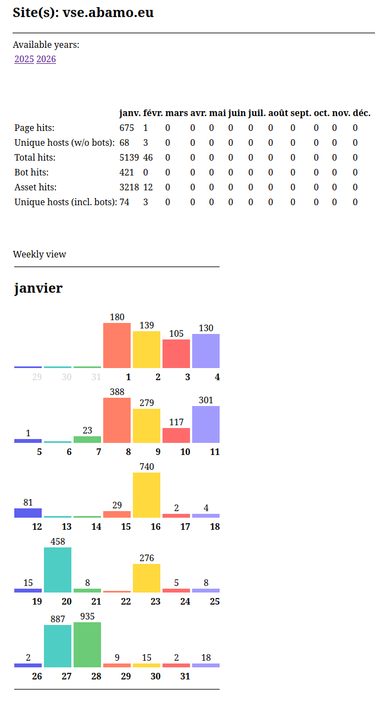

# JAWAStats - Java Web Statistics

Inspired by end of life AWStats (see below) and focused only on Caddy server side logs.

Development is in progress.

# AWStats - Advanced Web Statistics

AWStats (Advanced Web Statistics) was a powerful, full-featured web server
logfile analyzer which shows you all your Web statistics including: visitors,
pages, hits, hours, search engines, keywords used to find your site, broken
links, robots and many more...

## ABOUT THE AUTHOR, LICENSE AND SUPPORT

Copyright (C) since 2026 - ME aka ppavel-k https://vse.abamo.eu https://www.amame.cz

This program is free software; you can redistribute it and/or modify
it under the terms of the GNU General Public License as published by
the Free Software Foundation; either version 3 of the License, or
(at your option) any later version.

This program is distributed in the hope that it will be useful,
but WITHOUT ANY WARRANTY; without even the implied warranty of
MERCHANTABILITY or FITNESS FOR A PARTICULAR PURPOSE.  See the
GNU General Public License for more details.

You should have received a copy of the GNU General Public License
along with this program. If not, see <https://www.gnu.org/licenses/>.

Additionally, this software and derivatives cannot be used in countries:
Russia, Belorussia, Cuba, Iran, North Corea and by any linked companies and associations,
including occupied territories.